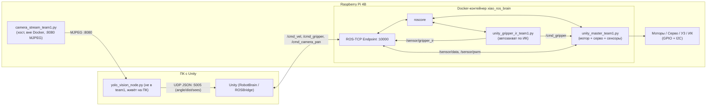

# Методичка: как управляется робот Xiao-r GFS-X (папка `team1`)

> Разбор всех файлов, доступных по SSH на роботе (`Materials/team1`). Документ отвечает на вопрос
> «как физически едет/хватает/видит робот» и явно разделяет **вендорский код** (дан готовым при
> покупке платформы XiaoR Geek) от **кода, написанного/адаптированного командой** в рамках практик кемпа.
>
> Ничего в `Materials/team1` не менялось — это справочный документ.

---

## 1. Общая архитектура и поток данных

Робот управляется не напрямую, а через ROS1 Noetic, поднятый в Docker-контейнере
`xiao_ros_brain`. Unity — клиент этого ROS через `ROS-TCP-Connector` (порт `10000`).
Видео идёт отдельным путём, мимо ROS и Docker.



Два независимых канала:
1. **Управление и телеметрия** — через ROS (моторы, серво, УЗ/ИК-датчики).
2. **Зрение** — отдельный MJPEG-поток с хоста Raspberry Pi (без ROS и без Docker, т.к. в
   контейнере нет `cv2`), который читает YOLO-скрипт на ПК и шлёт координаты мяча в Unity по UDP
   напрямую (см. `P7_YOLO_Deployment_Guide.md` — тот скрипт живёт на ПК, а не в `team1`).

---

## 2. Что дано «из коробки» (вендорский код + инфраструктура)

Это код, который командой **не писался**, а используется как библиотека/утилита.

### 2.1 Библиотека драйверов `XiaoRGeek` (китайский вендор, права © 小R科技)

Все файлы имеют заголовок `树莓派WiFi无线视频小车机器人驱动源码` («драйвер WiFi-робота на
Raspberry Pi») и лицензионную пометку вендора. Это низкоуровневый слой поверх GPIO/I2C:

| Файл | Назначение |
|---|---|
| `xr_gpio.py` | Инициализация GPIO (BCM-нумерация), константы пинов моторов (`IN1..IN4`, `ENA/ENB`), УЗ (`TRIG/ECHO`), ИК (`IR_L/IR_R/IR_M/IRF_L/IRF_R`), функции `digital_write/digital_read/ena_pwm/enb_pwm`. |
| `xr_servo.py` | Класс `Servo`: отправка угла сервопривода по I2C (`set(servonum, angle)`), ограничение угла (`angle_limit`), сохранение/восстановление углов в `data.ini` (`store/restore`). |
| `xr_ultrasonic.py` | Класс `Ultrasonic.get_distance()` — тайминг HC-SR04 через `TRIG/ECHO`. Также содержит вендорские демо-функции автопилота (`avoidbyragar`, `maze` — обход препятствий/прохождение лабиринта «из коробки»), которые в проекте команды **не используются** — логика объезда и навигации к мячу реализована заново в Unity (`RobotBrain.cs`) и в мастер-скрипте. |
| `xr_i2c.py` | Низкоуровневая обёртка над `smbus` для записи в MCU-плату расширения (адрес `mcu_address`). |
| `xr_motor.py` | Класс `RobotDirection` — вендорская абстракция «вперёд/назад/влево/вправо» поверх GPIO, используется внутри `xr_ultrasonic.py` для демо-режимов. |
| `xr_infrared.py` | Логика вендорского «следования по линии» / «следования за рукой» (см. PDF-мануал, разд. 4.3) — в пайплайне команды не задействована. |
| `xr_config.py`, `xr_configparser.py` | Глобальные константы (`cfg.ANGLE_MIN/MAX`, `cfg.DISTANCE` и т.д.) и чтение/запись `data.ini`. |
| `xr_pid.py`, `xr_power.py`, `xr_oled.py`, `xr_voice.py`, `xr_socket.py` | ПИД-регулятор, чтение напряжения АКБ, вывод на OLED-экран, звук/зуммер, протокол вендорского мобильного приложения (raw TCP). Использовались штатным приложением XiaoR Geek (см. PDF, разд. 4), в связке Unity↔ROS не задействованы. |

**Важный нюанс вендорского кода**: `xr_ultrasonic.py` при импорте тянет за собой `xr_motor`,
`xr_servo` и `xr_socket`, а `xr_socket` — ещё и `xr_car_light`/`xr_music` (светодиоды/пищалка,
которых физически нет в этой сборке под ROS). Из-за этого получить работающий `Ultrasonic()`
без этих модулей нельзя — см. п. 3.1 про заглушки.

### 2.2 Инфраструктура (не код робота, а окружение)

| Файл | Что это |
|---|---|
| `get-docker.sh` | Официальный скрипт `get.docker.com` для установки Docker на Raspberry Pi — использован один раз при первичной настройке, к логике робота отношения не имеет. |
| `smbus.py` | Сторонняя библиотека **`smbus2`** (MIT-лицензия, автор Karl-Petter Lindegaard) — чистый Python-порт `smbus`, которого нет в минимальном образе `ros_noetic_hardware_v2`. Команда не писала её сама, а подложила готовую реализацию под драйвер `xr_i2c.py`, чтобы I2C заработал без системного пакета `python3-smbus` внутри контейнера. |
| `Dockerfile_Upd` | Слой поверх базового образа `my_old_ros_base` (сам базовый образ не входит в `team1` — он уже собран на Pi заранее). Ставит `python3-smbus`, `i2c-tools`, `opencv-python-headless`, `v4l2py`. |
| `simhei.ttf` | Китайский TTF-шрифт, нужен `xr_oled.py`/стримеру для вывода текста — используется «как есть». |

---

## 3. Файлы, написанные / адаптированные командой в рамках практик

Это ядро методички — то, что реально делали вы. Разбито по ролям.

### 3.1 Финальный рабочий пайплайн (то, что запускает `start_robot_team1.sh`)

#### `unity_master_team1.py` — главный ROS-узел (мотор + рука + сенсоры), 389 строк

Один узел `unity_robot_master`, который подписывается на 3 топика от Unity и публикует 2 топика
телеметрии. Ключевые блоки построчно:

**Инициализация драйверов (10–50)**: импорт `xr_gpio`, `xr_ultrasonic.Ultrasonic()` и переиспользование
уже созданного внутри неё объекта `servo` (`xr_ultrasonic.servo`) — сделано специально, **чтобы не
инициализировать I2C дважды** (комментарий в коде: «защита от двойной I2C»). Всё обёрнуто в
`try/except` с `traceback.format_exc()` — если датчик физически отвалится, узел не упадёт целиком,
а просто отключит соответствующий функционал (`HAS_GPIO/HAS_SENSORS/HAS_SERVO`).

**Моторы, дифференциальный привод (56–193)**:
- `L = 0.15` (колёсная база, м), `MAX_SPEED_M_S = 0.5`, `PWM_CONVERSION_FACTOR = 100/0.5 = 200`.
- `vel_callback(/cmd_vel)`: `lin_x` клампится в `±MAX_LINEAR=0.25`; угловая скорость сглаживается
  экспоненциальным фильтром `EMA_STEER=0.40`, чтобы модель ML-Agents не дёргала рулём резко.
  Дифпривод: `v_left = lin + ang*TURN_K`, `v_right = lin - ang*TURN_K`, `TURN_K=0.25`.
- `set_motors_pwm()` — самая «инженерная» часть файла:
  - **Инверсия левого мотора** (строка 78) — задокументирована как результат ручного теста
    05.06.2026 («без инверсии робот поворачивает вместо езды вперёд»).
  - **HARD STOP v18** (80–96) — если оба целевых PWM ~0, стоп мгновенно, без рампы (иначе
    оставался остаточный ход 3-4 тика).
  - **Soft-start** (98–108) — изменение PWM ограничено `MAX_PWM_STEP=15` за тик, защита от
    пускового тока/back-EMF.
  - **Мёртвая зона мотора** (110–122) — PWM < `MOTOR_DEAD_ZONE=10` → 0; PWM в диапазоне
    `[10, MIN_MOTOR_PWM=35)` → принудительно поднимается до 35 (иначе мотор просто гудит, не
    крутясь). Отдельно закомментирован баг («FIX»), который раньше заставлял робот крутиться на
    месте при малом `steering`.
  - Публикует фактический PWM в `/sensor/pwm` (для диагностики/логирования).
- `watchdog_callback()` — таймер каждые 0.2с; если `/cmd_vel` не приходил дольше `WATCHDOG_TIMEOUT=0.5с`
  (Unity зависла/отключилась/потеряла Wi-Fi) — аварийный стоп моторов.

**Манипулятор (212–285)**:
- Серво: `SERVO_BASE=1, SERVO_SHOULDER=2, SERVO_ELBOW=3, SERVO_CLAW=8, SERVO_CAMERA_PAN=5`.
- `gripper_callback(/cmd_gripper)` — конечный автомат из 4 команд: `1`=опустить руку+открыть
  клешню, `2`=закрыть клешню+поднять руку, `3`=стартовая поза (`init_arm`), `4`=**только**
  открыть клешню без движения руки (нужна отдельно для `unity_gripper_ir_team1.py`, см. ниже).
- `camera_callback(/cmd_camera_pan)` — плавное слежение камеры: цель не применяется мгновенно, а
  «подъезжает» не быстрее `MAX_CAMERA_STEP=15°` за тик.

**Сенсоры (290–340)**: таймер 10 Гц (`Duration(0.1)`), публикует один `Quaternion` (x,y,z,w — тип
сообщения переиспользован «не по назначению», чтобы влезли 4 значения без кастомного ROS-типа):
- `x` — УЗ-дистанция в метрах, **с медианным фильтром** окна 3 (убирает одиночные всплески 0/500см).
- `y`, `z` — левый/правый ИК препятствий, **с фильтром дребезга** (срабатывание только если ≥2 из
  последних 3 показаний совпадают).
- `w` — ИК-датчик в клешне (`gpio.IR_M`, пин 22). В коде явно отмечено как **исправленный баг**:
  раньше значение было захардкожено в `0.0`, из-за чего автозахват на реальном роботе никогда не
  срабатывал.

**Аварийная остановка (367–388)**: `atexit.register(emergency_stop)` — при любом завершении
процесса (в т.ч. `Ctrl+C`/креш) моторы гарантированно глушатся напрямую через GPIO.

#### `unity_gripper_ir_team1.py` — автозахват мяча (118 строк)

Отдельный ROS-узел `unity_gripper_ir`, работает **параллельно** с мастер-узлом (это явно
задокументировано в docstring файла, вместе с предупреждением не импортировать `xr_servo`/
`xr_ultrasonic` повторно — иначе конфликт по I2C-сокету).

- Читает только пин `IR_M` (own `read_ir_m()`, дублирует логику мастера, но без сервоприводов).
- `POLL_HZ=20`, `DEBOUNCE_COUNT=3` — скользящий буфер, стабильное значение = сумма последних 3
  показаний `≥ DEBOUNCE_COUNT`.
- Публикует состояние в `/sensor/gripper_ir` (Unity видит как `gripperIR`) **и** параллельно шлёт
  команду `/cmd_gripper` в мастер-узел **только по изменению** стабильного состояния:
  появился мяч → `cmd=2` (закрыть), мяч пропал → `cmd=4` (открыть **только клешню**, рука не
  двигается — иначе рука бы каждый раз дёргалась вверх-вниз).

#### `camera_stream_team1.py` — видеостример (119 строк)

Простой многопоточный HTTP MJPEG-сервер на чистом `http.server` + `cv2`:
- Отдельный поток (`CameraThread`) непрерывно читает камеру (`cv2.VideoCapture(0)`, 320×240),
  кодирует в JPEG (качество 80) и кладёт в общий буфер под `Lock`.
- `StreamingHandler.do_GET()` отдаёт `multipart/x-mixed-replace` (стандартный MJPEG) с троттлингом
  ~25 FPS (`time.sleep(0.04)`), корректно обрабатывает обрыв соединения клиента.
- Порт `8080`, путь `/`. Запускается **на хосте**, а не в Docker (в контейнере нет `cv2` — см.
  закомментированную строку 50 в `start_robot_team1.sh`).

#### Скрипты запуска — `start_robot_team1.sh`, `camera_stream_team1.sh`, `stop_mjpg_streamer.sh`

`start_robot_team1.sh` — идемпотентный скрипт полного передеплоя:
1. Отключает Wi-Fi power-save (`iw dev wlan0 set power_save off`) — иначе ROS-TCP рвётся от
   энергосбережения адаптера.
2. Жёстко удаляет и пересоздаёт контейнер `xiao_ros_brain` **с нуля** из образа
   `ros_noetic_hardware_v2` (`--network host --privileged -v /dev:/dev` — контейнеру нужен прямой
   доступ к GPIO/I2C устройствам хоста).
3. Копирует внутрь контейнера `unity_master_team1.py`, `unity_gripper_ir_team1.py`,
   `smbus.py` → `/root/XiaoRGeek/`, заглушки `xr_car_light.py`/`xr_music.py` → `/root/XiaoRGeek/`.
   **Тот факт, что копируются именно эти два .py-файла (а не `control*.py`/`unity.py`/старые
   микросервисы), подтверждает: это единственная официальная «прод»-версия.**
4. Поднимает `roscore`, затем ROS-TCP Endpoint (`rosrun ros_tcp_endpoint default_server_endpoint.py
   --tcp_ip 0.0.0.0 --tcp_port 10000`), затем оба узла в фоне с выводом в `/tmp/master.log` и
   `/tmp/gripper_ir.log`.

`camera_stream_team1.sh` — тонкая обёртка, просто запускает `camera_stream_team1.py` на хосте.

`stop_mjpg_streamer.sh` — убивает процесс `input_uvc.so` (это плагин классического
`mjpg-streamer`, **другого**, не связанного с `camera_stream_team1.py` инструмента). Похоже на
остаток от более раннего эксперимента со стандартным `mjpg-streamer` до перехода на
самописный Python-стример — сейчас, судя по всему, не нужен.

#### `xr_car_light.py` / `xr_music.py` — заглушки (написаны командой)

Несмотря на имя в стиле вендорской библиотеки, это **два маленьких файла, специально написанных
командой**, чтобы обойти проблему из п. 2.1: `xr_ultrasonic.py` тянет по цепочке импортов модули
светодиодной ленты и пищалки, которых в этой сборке (ROS + Docker) нет. Оба — классы-пустышки
с `__getattr__`, возвращающим no-op лямбду на любой вызов метода.

---

### 3.2 Эволюция архитектуры (более ранние версии — сохранены в папке, но не используются)

По коду видно чёткую историю разработки в три этапа:

**Версия 1 — три независимых ROS-микросервиса** (в файлах прямо написано `--- [ВЕРСИЯ 1] ---`):
- `unity_gripper.py` — узел `unity_bridge_gripper`, только манипулятор, слушает `/cmd_gripper`.
- `unity_camera.py` — узел `unity_bridge_camera`, только поворот камеры, слушает `/cmd_camera_pan`.
- `unity_sensors.py` — узел `unity_bridge_sensors`, публикует УЗ+2×ИК в `Vector3` (без 4-го
  значения — клешневый ИК тогда ещё не публиковался).

**Версия 3 — только моторный мост**, объединённый, но без руки/сенсоров:
- `unity.py` — узел `unity_bridge_motors`, дифпривод с `L=0.20`, `MIN_MOTOR_PWM=20`, **без**
  soft-start-рампы и watchdog, с явным комментарием про разницу знаков поворота между ROS-конвенцией
  и Unity.

**Финал** — всё это слито в `unity_master_team1.py` + вынесен отдельно `unity_gripper_ir_team1.py`,
добавлены soft-start, watchdog, HARD STOP, фильтры сенсоров, инверсия мотора, тип сообщения
расширен с `Vector3` до `Quaternion` (нужен был 4-й канал под ИК клешни).

**Важное расхождение калибровки между версиями** (стоит перепроверить руками перед стартом):

| Параметр | v1 (`unity_gripper.py`) | Финал (`unity_master_team1.py`) |
|---|---|---|
| `SERVO_CLAW` | 4 | **8** |
| `SERVO_CAMERA_PAN` | 7 | **5** |
| `ANGLE_CLAW_OPEN` | 10° | **90°** |
| `ANGLE_CLAW_CLOSE` | 90° | **90°** ⚠️ |

То есть между версиями сменился и физический канал сервопривода клешни, и калибровочные углы —
но в финальной версии `ANGLE_CLAW_OPEN` и `ANGLE_CLAW_CLOSE` совпадают (оба 90°). Это либо
означает, что клешня сейчас физически не различает открыто/закрыто, либо калибровку под новый
канал (8) ещё не докрутили до конца. **Стоит проверить руками на роботе перед эстафетой.**

---

### 3.3 Ручное управление (для тестов, не часть автопайплайна)

Все три — консольные приложения на `curses`, управляют роботом напрямую с клавиатуры, минуя ROS
и Unity целиком (используют дублирующие копии `gpio.py`/`servo.py` вместо `xr_gpio.py`/`xr_servo.py`
— по содержимому идентичны, отличаются только удалёнными китайскими комментариями).

- **`control4.py`** — самая ранняя: 8 сервоприводов, простое 4-направленное движение (вперёд/
  назад/влево/вправо через жёсткий разворот на месте).
- **`control6.py`** — добавляет «дуговые» повороты (когда крутится только один борт, а не оба
  противоположно) для более плавных манёвров; серво сокращены обратно до 4.
- **`control7.py`** (207 строк) — финальная и наиболее продуманная версия ручного управления:
  неблокирующий ввод (`stdscr.nodelay(True)`), автоостановка WASD по таймауту `DIR_TIMEOUT=0.2с`
  если клавиша отпущена (эмуляция «геймпадного» поведения на клавиатуре), 8 комбинаций
  движения включая 4 дуговых поворота, регулировка скорости (`,`/`.`) и шага угла серво (`+`/`-`)
  на лету, отдельная калибровка для 4-й сервы (`SERVO4_MIN=44, SERVO4_MAX=97` — видимо, клешня
  на момент написания этого скрипта).
- **`controlfinal.py`** ⚠️ — **несмотря на имя, файл сломан**. Это `control7.py`, в начало
  которого «расплющен» код из `xr_servo.py`/`xr_gpio.py`: функции `set`, `store`, `restore`,
  `angle_limit` объявлены на уровне модуля (с параметром `self`, как будто это методы класса), но
  класс `Servo` нигде не определён. На строке, где раньше было `servo = Servo()`, будет
  `NameError: name 'Servo' is not defined`. Похоже на неудачную попытку сделать самодостаточный
  скрипт без внешних импортов — **не использовать, использовать `control7.py`**.
- **`gamepad.py`** (273 строки) — управление физическим геймпадом через сырой Linux joystick API
  (`/dev/input/js0`, бинарный формат событий `struct.unpack("IhBB", ...)` без внешних библиотек).
  Левый стик — газ/руль (с нормализацией векторной суммы `left/right`, чтобы газ+руль вместе не
  давали PWM > 100%), правый стик — база/плечо манипулятора, курки (`LT/RT`) и кнопки — клешня и
  локоть. Отдельная дедзона на стики (`0.2`) и на сервоприводы (`0.15`).
- **`robot_direct.py`** (205 строк) — **альтернативная архитектура без ROS и без Docker**:
  собственный UDP JSON-сервер на порту `10005`, принимающий от Unity сырые сообщения
  `{"type": "twist"/"gripper"/"camera", ...}` напрямую в GPIO/серво. По сути «облегчённая копия»
  `unity.py`+`unity_gripper.py`, но в одном файле и без ROS-прослойки. Судя по всему — запасной
  вариант на случай проблем с Docker/ROS-TCP-Connector во время мероприятия (использует другой
  порт — 10005 вместо 10000, значит, конфигурация Unity под него должна переключаться отдельно).

### 3.4 Диагностика и калибровка

- **`detect_pin.py`** — утилита «прощупывания» пинов: слушает все «безопасные» GPIO (кроме
  моторных, чтобы робот случайно не поехал) и печатает номер пина, на котором изменилось
  состояние — используется, чтобы быстро определить, к какому GPIO физически подключён новый
  датчик.
- **`test_ir.py`** — вывод состояния всех 5 ИК-пинов в реальном времени.
- **`test_claw.py`** — ручной ввод угла клешни с клавиатуры для калибровки открытого/закрытого положения.
- **`test_gripper_ir.py`** — автономный (без ROS) тест логики автозахвата, дублирующей
  `unity_gripper_ir_team1.py`, но со **старой** калибровкой (`SERVO_CLAW=4`,
  `ANGLE_CLAW_OPEN=50/CLOSE=89`) — не актуализирован под финальную распиновку (см. таблицу выше),
  использовать для диагностики стоит с поправкой на это несоответствие.
- **`test_gripper_reflex.py`** — вариант теста рефлекса клешни на **другом** пине (`IR_PIN=24`,
  а не `IR_M=22`, как везде) — либо ошибка, либо ещё более старая распиновка.
- **`test_uz_vs_camera.py`** / **`test_uz_vs_camera_ros.py`** — диагностика «не бьёт ли луч
  ультразвука в собственный корпус робота при повороте камеры»: перебирают углы серво камеры
  0..180° с шагом 10°, на каждом шаге снимают УЗ-дистанцию и печатают таблицу с пометкой
  «🔴 ПЛАТА?!» для углов, где расстояние подозрительно маленькое (<30см). Версия `_ros` делает
  это через реальные ROS-топики (`/cmd_camera_pan` → `/sensor/data`), не-ROS версия — напрямую
  через драйверы.

---

## 4. Таблица ROS-топиков (интерфейс Unity ↔ робот)

| Топик | Тип | Направление | Кто публикует / кто слушает |
|---|---|---|---|
| `/cmd_vel` | `geometry_msgs/Twist` | Unity → робот | слушает `unity_master_team1.py` (`vel_callback`) |
| `/cmd_gripper` | `std_msgs/Int32` | Unity → робот **и** внутренний | слушает `unity_master_team1.py`; публикует также `unity_gripper_ir_team1.py` (автозахват) |
| `/cmd_camera_pan` | `std_msgs/Float32` | Unity → робот | слушает `unity_master_team1.py` (`camera_callback`) |
| `/sensor/data` | `geometry_msgs/Quaternion` | робот → Unity | публикует `unity_master_team1.py`: `x`=УЗ(м), `y`=ИК-лево, `z`=ИК-право, `w`=ИК-клешня |
| `/sensor/gripper_ir` | `std_msgs/Int32` | робот → Unity | публикует `unity_gripper_ir_team1.py` |
| `/sensor/pwm` | `geometry_msgs/Vector3` | робот → (телеметрия/лог) | публикует `unity_master_team1.py`: фактический PWM левого/правого борта |

**Команды `/cmd_gripper`**: `1`=опустить руку+открыть клешню (подготовка к захвату), `2`=закрыть
клешню+поднять руку (захват), `3`=стартовая поза, `4`=открыть только клешню без движения руки
(используется автозахватом при потере мяча).

## 5. Сервоприводы и физические каналы (актуальные, из `unity_master_team1.py`)

| Серво | Канал (I2C) | Назначение | Углы |
|---|---|---|---|
| `SERVO_BASE` | 1 | Поворот основания руки | центр 90° |
| `SERVO_SHOULDER` | 2 | Плечо | вверх 180° / вниз 0° |
| `SERVO_ELBOW` | 3 | Локоть | вверх 95° / вниз 0° |
| `SERVO_CLAW` | **8** | Клешня | открыто 90° / закрыто 90° ⚠️ *(см. п. 3.2)* |
| `SERVO_CAMERA_PAN` | 5 | Поворот камеры | 0–180°, центр 90° |

GPIO-пины (BCM, из `xr_gpio.py`): моторы `IN1=16, IN2=19, IN3=26, IN4=21`, ШИМ `ENA=13, ENB=20`;
УЗ `TRIG=17, ECHO=4`; ИК `IR_L=27, IR_R=18, IR_M=22 (клешня), IRF_L=1, IRF_R=25`.

---

## 6. На что обратить внимание перед следующим запуском

1. **Логи пустые** (`master.log`, `gripper_ir.log` — 0 байт на момент разбора) — нет
   подтверждения, что текущая версия реально запускалась и отработала на роботе после последних
   правок. Первым делом после `./start_robot_team1.sh` стоит проверить оба лога на ошибки импорта/traceback.
2. **Калибровка клешни `90°/90°`** — открыть/закрыть совпадают, физически проверить, что клешня
   действительно раскрывается и сжимается на канале 8.
3. **`controlfinal.py` не рабочий** — для ручного управления используйте `control7.py`.
4. **`test_gripper_ir.py`/`test_gripper_reflex.py`** откалиброваны под старую распиновку — не
   ориентируйтесь на их углы, только на логику опроса пина.
5. Не запускайте одновременно `unity_master_team1.py`/`unity_gripper_ir_team1.py` вместе с
   `control*.py`/`gamepad.py`/`robot_direct.py` — все они инициализируют одни и те же I2C/GPIO
   ресурсы и будут конфликтовать.

## 7. Чеклист типового перезапуска

```bash
ssh pi@192.168.2.<номер робота>          # пароль: raspberry
cd team1
./start_robot_team1.sh                    # пересоздаёт контейнер, поднимает roscore/endpoint/узлы
./camera_stream_team1.sh                  # отдельно, вне докера — видео на :8080
# проверка:
docker exec xiao_ros_brain cat /tmp/master.log
docker exec xiao_ros_brain cat /tmp/gripper_ir.log
```

---

## 8. Сверка с референсным проектом

Когда появится доступ к пробному полному проекту с GitHub (команда сказала не копировать
целиком, а посмотреть на общую структуру) — стоит сверить в первую очередь:
- архитектуру ROS-узлов (один узел на всё vs несколько микросервисов — у нас в итоге выбран
  первый вариант, см. п. 3.2);
- есть ли в референсе аналог soft-start/watchdog/фильтров дребезга, или это добавлено сверх
  типового шаблона;
- как там раскладка портов и топиков — совпадает ли `/cmd_vel`/`/cmd_gripper`/`/cmd_camera_pan`
  с тем, что уже реализовано здесь (если Unity-часть проекта их так и называет — переименовывать
  ничего не потребуется).

Раздел будет дополнен после того, как вы поделитесь ссылкой/содержимым.
